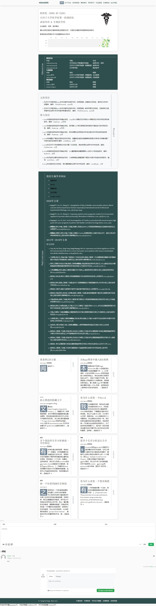

yihui的Hugo-prose主题很简约，然后也有一些问题，比如表格太宽的话就会溢出，这个问题我在GitHub上咨询上，给我的答复是无解，而且看久了，prose主题确实也不是很美观。

作为一个天秤座，本身就有选择困难症，你说我不在乎博客的美观，连我自己都不相信，所以一直在寻找比较颜值高实用的主题，最近看上了一个zzo的主题，功能很齐全，也很美观，后期就把这个站的主题换掉。

截个图纪念一下：

